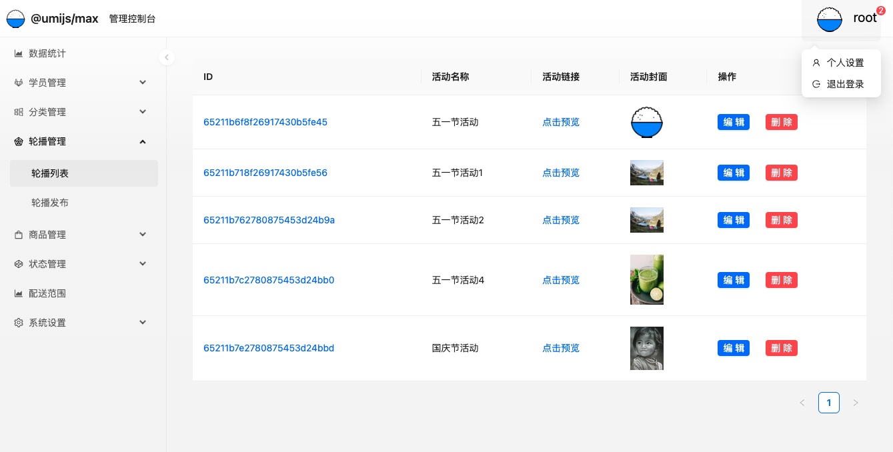
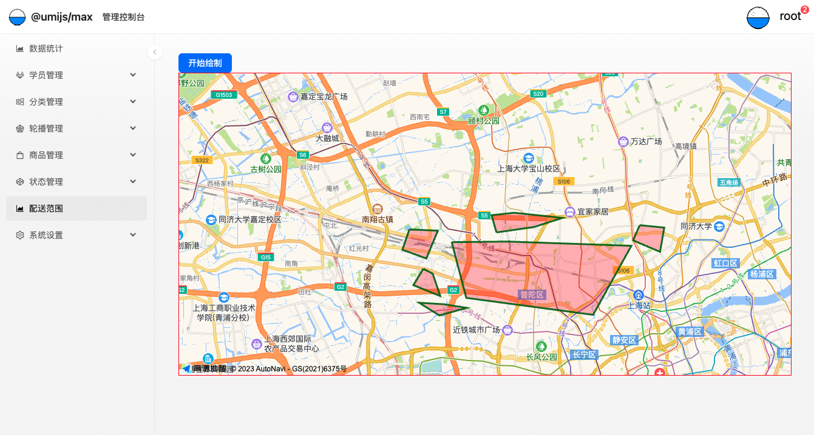

# README

`@umijs/max` 模板项目，更多功能参考 [Umi Max 简介](https://umijs.org/docs/max/introduce)

### 使用

1. 在[LeanCloud](https://console-e1.leancloud.cn/apps/m5EfUDt71FM4z2asxZAcxAAV-9Nh9j0Va/storage/data/stu) 中注册账号，创建应用，获取到`BASE_URL` ，`LEARNCLOUD_ID`，`LEARNCLOUD_KEY`
2. 地图模块中需要自己进入[高德地图](https://lbs.amap.com/api/javascript-api/guide/abc/prepare) 开发者平台创建应用获取`KEY`，`SECRET`
3. 填入到项目根目录`.nev`模块中
4. 安装完依赖 `yarn i`
5. 启动 `yarn dev`

### 技术点

1. 约定式路由和配置式路由
2. umirc 和 config 配置文件及配置拆分
3. umi 的插件开发: 
   1. [layout插件](https://umijs.org/docs/max/layout-menu)：布局和菜单
   2. [And Design 插件](https://ant.design/components/overview-cn): 样式组件库
      1. Card、Row、Col、Table、Form、Spin、message、Upload、Badge、Dropdown、List
   3. [全局初始状态](https://umijs.org/docs/max/data-flow)
   4. [request请求插件](https://umijs.org/docs/max/request): umi 内置网络请求, useRequest 的 hook
   5. [Access 插件](https://umijs.org/docs/max/access)：权限控制
      1. 页面级别控制
      2. 组件级别控制：轮播管理的操作按钮
   6. [dva 状态机插件](https://umijs.org/docs/max/dva)
4. [Mock.js](https://umijs.org/docs/guides/mock): 模拟数据
5. [LeanCloud](https://console-e1.leancloud.cn/apps/m5EfUDt71FM4z2asxZAcxAAV-9Nh9j0Va/storage/data/stu): 远端数据
   1. 增删改查批量：GET、POST、DELETE、PUT、PATCH
   2. 上传 base64 文件
6. [WangEditor](https://www.wangeditor.com/): 富文本编辑器
   1. 富文本上传图片
   2. 封装富文本供外面使用
7. 批量转存外部数据入库: https://h5.mcake.com/#/cake
8. [immer](https://immerjs.github.io/immer/zh-CN/)：不可变数据处理，只更新变化关联的数据部分
9. 跨域处理
10. [高德地图](https://lbs.amap.com/api/javascript-api/guide/abc/prepare)
11. 环境变量设置：`process.env`url，key，id
12. [plugin.ts](https://umijs.org/docs/guides/directory-structure#plugints)：插件API，项目中高德地图需要修改产物html，增加script脚本

### 业务实现：

1. umi配置：构建时配置、运行时配置
2. 登录页：登录和注册
3. 数据统计页
4. 学员管理：列表和新增
5. 分类管理：列表、新增、删除
6. 轮播管理：列表、新增、删除、编辑，支持上传图片
7. 商品发布：新增，富文本编辑，富文本支持上传图片，获取外部资源批量转存
8. 消息中心：
   1. dva状态管理，获取消息列表，置为已读状态
   2. [immer](https://immerjs.github.io/immer/zh-CN/)：不可变数据处理
9. 系统设置：新增角色，根据角色创建用户
10. 高德地图
11. 权限管理

